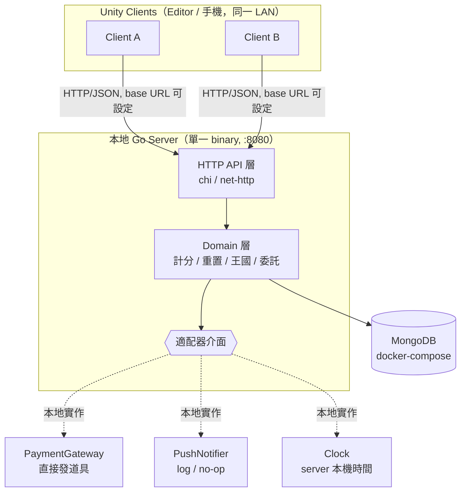

# 本地 Server 架構規畫
### Daily Kingdoms — Local-First Backend

> 目標:現在用**本地 server** 跑通所有「需要伺服器」的功能(server 權威重置、王國彙總、付費委託任務),等有資源時把同一套程式部署到正式 server,**遊戲邏輯與 API 合約不變,只換部署與少數適配器**。
>
> 本文件為《日常王國》企畫書的後端技術附篇,對應企畫書 §7 的王國排行——有了本地 server 後,即使是原型階段,多個 client 也能做**真實**的跨玩家彙總(不需任何模擬)。

---

## 1. 設計原則

1. **Server 權威(server-authoritative)**:每日重置(凌晨 3:00)、任務生成、計分、道具扣除、委託發送,全部由 server 決定,client 只負責呈現與輸入。這是「現在就做成 server 形狀」的核心價值。
2. **同一套協定,兩端通用**:client 透過 HTTP/JSON 打一個**可設定的 base URL**(`localhost:8080` → 日後換成正式網域),client 程式碼不需改動。
3. **Ports & Adapters(六角架構)**:把「本地與正式不同」的東西抽成介面(付款、推播、時鐘),本地用假實作、正式用真實作。遷移 = 換適配器,不動 domain。
4. **真實的持久化**:本地直接用 MongoDB(對應你熟悉的 prod stack),schema 與 query 可直接帶到正式環境。
5. **LAN 可測多人**:server 綁 `0.0.0.0`,讓同一 Wi-Fi 下的手機直接打開發機,用兩個真實 client 測王國彙總與發任務。

---

## 2. 整體架構



---

## 3.「本地」的定義與好處

**本地 = 一支 Go binary 跑在你的開發機(或 LAN)上**,搭一個本機 Mongo,沒有雲端、沒有真金白銀、沒有真的推播。

它能讓你在零維運成本下驗證:

- **協定與資料模型**:API 合約、JSON 結構、DB schema 一次定型。
- **server 端遊戲邏輯**:3 點重置邊界、計分公式、連勝、王國彙總、委託任務扣道具與寫收件匣,全部在 server 跑。
- **真實多 client**:Editor + 手機(或兩支手機)同時連本地 server,就能實測「王國 vs 王國」彙總、以及 A 玩家付費發任務給 B 玩家。

---

## 4. 關鍵設計:Server 權威 + 適配器隔離

### 4.1 適配器介面(本地 vs 正式的唯一差異點)

```go
// 時鐘:重置邊界、發任務時間一律走這裡(禁止用 client 時間)
type Clock interface {
    Now() time.Time
}

// 付款:本地直接發道具;正式接 Apple / Google 收據驗證
type PaymentGateway interface {
    Grant(ctx context.Context, playerID, sku string) (Receipt, error)
}

// 推播:本地 no-op(client 改用輪詢 inbox);正式接 FCM / APNs
type PushNotifier interface {
    Notify(ctx context.Context, playerID string, payload Payload) error
}
```

本地啟動時注入假實作,正式環境注入真實作 —— **domain 與 API 完全不知道差別**。

### 4.2 遊戲日邊界(3 點重置,server 算)

```go
// 將時間往前推 3 小時後取日期 = 該玩家的「遊戲日」
// 02:59 → 推 3h → 前一天 23:59 → 屬前一遊戲日
// 03:00 → 推 3h → 當天 00:00 → 新遊戲日
func gameDay(now time.Time, loc *time.Location) string {
    return now.In(loc).Add(-3 * time.Hour).Format("2006-01-02")
}
```

任務生成採 **lazy 策略**:玩家跨過 3 點後第一次呼叫 `GET /v1/daily`,server 發現該遊戲日尚無任務組就即時生成並寫入,不需要排程 job(正式環境再考慮要不要加預生成 job)。

---

## 5. API 介面(合約,本地與正式不變)

| Method | Path | 用途 | 備註 |
|--------|------|------|------|
| POST | `/v1/auth/anonymous` | 取得 playerId + token | 本地發 uuid + 簡易 token |
| GET | `/v1/players/me` | 取得個人檔案 | 貢獻 / 連勝 / 階級 |
| GET | `/v1/skills` | 玩家技能等級/經驗 | 含各技能下一解鎖階層 |
| POST | `/v1/players/me/race` | 選擇種族（犬/貓/翼） | 純身分；設定 race 與 homeKingdom（不影響分數） |
| GET | `/v1/players/lookup?code=` | 用好友碼查玩家 | 發任務用 |
| GET | `/v1/daily` | 取今日任務看板 | server 依 3 點邊界 lazy 生成；**全任務列表**（已拍板）含活躍度分數與階段領取狀態；M1 加技能後只放已解鎖階層 |
| POST | `/v1/daily/{taskId}/complete` | 完成任務 | 基礎分加到所屬王國（無連勝乘數，已拍板）＋ 累積活躍度;活躍度首達 120 即連勝 +1;M1 起 ＋ 技能經驗 |
| POST | `/v1/daily/rewards/{stage}/claim` | 領取活躍度階段獎勵 | 階段 30/60/90 各 10 星砂；最終階段（120）= 50 + 10×連勝，封頂 25 天（企畫書 §6.1） |
| GET | `/v1/kingdoms/scores` | 三國總分與排名 | 跨 client 真實彙總 |
| GET | `/v1/inventory` | 道具清單 | 含「委託令」 |
| POST | `/v1/shop/purchase` | 購買道具 | 本地走 PaymentGateway 直接發 |
| POST | `/v1/commissions` | 發送委託任務 | 驗道具 / 頻率 / 封鎖 → 扣道具 → 寫收件匣 |
| GET | `/v1/inbox` | 拉收件匣 | 本地以輪詢取代推播 |
| POST | `/v1/inbox/{id}/complete` | 完成委託任務 | 依得分歸屬規則結算 |
| POST | `/v1/inbox/{id}/ignore` | 忽略委託 | 不懲罰 |

---

## 6. 資料模型(MongoDB collections)

```
players        { _id(playerId), friendCode, race("dog"|"cat"|"wing"),
                 homeKingdom, totalContribution, currentStreak,
                 longestStreak, lastStreakDay, stardust, rank, createdAt }
                 // lastStreakDay: 最近達成連勝線的遊戲日; stardust: 星砂（活躍度獎勵貨幣）
playerSkills   { _id, playerId, skillId, level, xp }   // 每位玩家每項技能的等級/經驗
skills         { _id("balance"), name("平衡"), kingdom("dog"),
                 maxLevel, xpCurve }                     // 技能定義
dailySets      { _id, playerId, gameDay("2026-06-10"), tasks[],
                 points, claimed[], generatedAt }
                 // tasks 為全任務列表（玩家自選）;points 今日活躍度;claimed[] 各階段領取狀態
                 // M1 加技能後 tasks 只放玩家已解鎖的階層
kingdomTotals  { _id:"dog"|"cat"|"wing", score, updatedAt }   // 各國任務累積貢獻分;或用 aggregation 即時算
taskTemplates  { _id(=Quest 表 ID, 首位=王國編號+4碼流水號), kingdom("dog"|"cat"|"wing"),
                 skillId, tier, unlockLevel, basePoints, skillXp }
                 // 來源為 Quest 資料表;每筆歸屬一國+一技能+階層;一般任務 skillId 可為 null
                 // 顯示文字走 Language 表（Quest_{ID} / Quest_{ID}_Desc），不存於此
inventory      { _id, playerId, sku, qty }
commissions    { _id, fromPlayerId, toPlayerId, taskTemplateId,
                 status:"pending|completed|ignored", createdAt }
```

> `race` 純身分、不影響計分;`homeKingdom` 僅作世界觀/外觀。完成任務時,**貢獻分**加到該任務 `kingdom` 指向的王國(與種族無關),**技能經驗**加到該任務 `skillId` 指向的技能;經驗跨過 `unlockLevel` 即解鎖該技能更高 `tier` 的任務。一般(非訓練型)任務 `skillId` 為 null,只給王國分。

> 委託任務的 `taskTemplateId` 只能引用 `taskTemplates` 內的項目(固定池),不接受自由文字 —— 從資料模型層就擋掉騷擾向量(見企畫書 §9.5)。

---

## 7. 專案結構(Go,遷移友善)

```
/server
  /cmd/server/main.go        // 組裝:讀 config、注入適配器、起 HTTP
  /internal
    /domain                  // 純遊戲規則:計分、重置、王國、委託(無框架依賴)
    /api                     // HTTP handler、路由、DTO
    /store                   // Mongo repo,實作 domain 介面
    /adapter
      /payment               // local(假) + 日後 apple/google
      /push                  // local(no-op) + 日後 fcm/apns
      /clock                 // 本機時間
  /config                    // config.local.yaml / config.prod.yaml
docker-compose.yml           // 本機 Mongo
```

domain 層不依賴 HTTP、不依賴 Mongo、不依賴付款 SDK —— 這是讓遷移無痛的關鍵。

---

## 8. 技術選型(本地)

- **語言**:Go(net/http 或 chi router;chi 輕量、好讀)
- **DB**:MongoDB,官方 `mongo-go-driver`(與正式環境一致)
- **執行**:`go run ./cmd/server`,綁 `0.0.0.0:8080` 讓 LAN 手機可連
- **Mongo**:`docker-compose up` 起一個本機 Mongo,免安裝污染
- **Unity client**:封一個 `ApiClient`(UnityWebRequest / HttpClient),base URL 放 config,localhost ↔ 正式只改一行

---

## 9. 開發階段

| 階段 | 目標 | 內容 |
|------|------|------|
| **L0** | 跑通核心循環(in-memory) | `/auth` + `/daily` + `/complete` + `/kingdoms/scores`,store 先用記憶體 map,Unity 指向 localhost,驗證 server 權威的每日循環 |
| **L1** | 接 Mongo + 技能 + 多人 + 委託 | store 換 Mongo;加 **技能經驗/升級/階層解鎖**、inventory / shop(假購買)/ commissions / inbox(輪詢);用 Editor + 手機兩端實測王國彙總與發任務 |
| **L2** | 收斂介面、可遷移 | 抽好 Clock / PaymentGateway / PushNotifier 介面、config 分檔、docker-compose、種子資料。此狀態即「隨時可搬上正式 server」 |

---

## 10. 遷移到正式 Server 對照表

| 面向 | 本地(now) | 正式 server(later) | 需動 domain? |
|------|-----------|---------------------|:---:|
| 部署 | dev 機 / LAN 單一 binary | Rocky Linux + HAProxy | ✗ |
| DB | 單機 Mongo(docker) | Mongo replica set master-slave | ✗（同 driver / query） |
| 付款 | PaymentGateway 直接發道具 | Apple / Google 收據驗證 | ✗（換適配器） |
| 推播 | PushNotifier no-op + client 輪詢 | FCM / APNs | ✗（換適配器 + client 收推播） |
| 時間 | Clock = 本機時區 | 同左 + NTP 校時 | ✗ |
| 認證 | 簡易匿名 token | 強化簽章 / 正式 token | ✗（介面不變） |
| 傳輸 | http | https(HAProxy 終結 TLS) | ✗ |
| 觀測 | console log | ELK | ✗ |

**唯一會變的**:`config`(網域、密鑰、TZ)、三個適配器的實作、部署方式。domain 邏輯與 API 合約原封不動。

---

## 11. 與企畫書的關係

- 實作企畫書 §7 的王國排行:王國分數是多 client 在「各國任務」上的**真實**累積彙總,不需任何模擬。
- 實作企畫書 §9.5 的「付費委託任務系統」:`/v1/shop/purchase` + `/v1/commissions` + `/v1/inbox` 即為其 server 端。
- 單純的單機離線版若仍要保留,可作為「無網路 fallback」:client 在連不到 server 時退化成本地存檔(企畫書 §9.1),連上後再同步。此為選用,視你要不要支援離線。

---

## 12. 待確認 / 下一步

1. **是否保留離線 fallback**:全程要 server,還是斷線可玩、回連同步?(影響 client 複雜度)
2. **委託任務得分歸屬**:發送者 / 接收者 / 雙方 —— 仍需先定方向(影響 `/inbox/complete` 結算邏輯與道具定位)。
3. **好友系統範圍**:發任務限好友,還是任意好友碼 + 封鎖?
4. ~~**下一步**:L0 的 Go 專案骨架~~ ✅ 已完成——`server/` 已可 `go run ./cmd/server`：auth / 選種族 / 每日看板（lazy 生成）/ 完成計分 / 活躍度階段與連勝 / 王國彙總，任務池讀 `server/data/quest.json`（由 Sheet Importer 同步）。下一步為 L1（Mongo + 技能 + 委託）。
