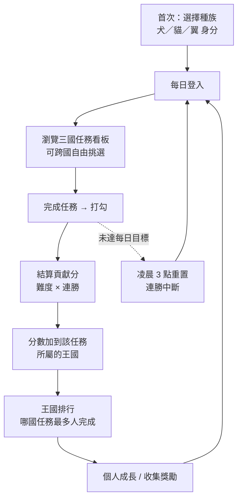
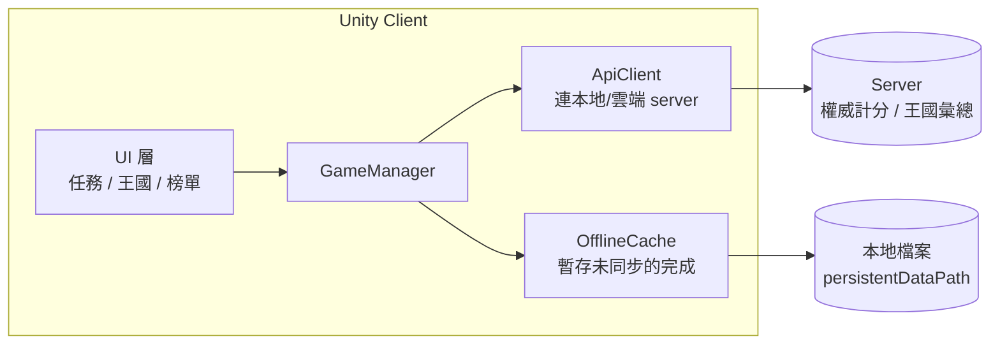
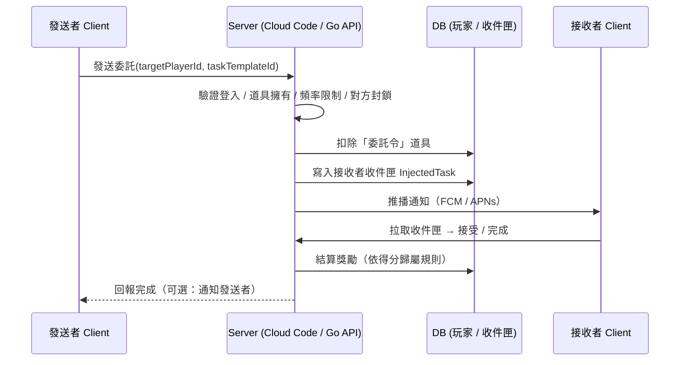

# 《日常王國》遊戲企畫書
### Daily Kingdoms — 犬 · 貓 · 翼

> 本文件為初版企畫，所有名稱、數值、係數皆為提案，標記「待確認」處為需要你拍板的設計決策。

---

## 1. 專案概述

| 項目 | 內容 |
|------|------|
| **產品定位** | 以「生活習慣養成」為核心的輕量化遊戲（Gamified Habit / Life-Quest App） |
| **一句話描述** | 選一個動物種族當化身，自由承接犬／貓／翼三國的生活任務，完成哪一國的任務就讓哪一國加分，看三國如何此消彼長。 |
| **目標平台** | iOS / Android（Unity 跨平台打包） |
| **引擎** | Unity 6（6000.3 LTS）|
| **第一階段範圍** | 先以本地 server 跑通核心循環（server 權威）；王國排行為跨 client 真實彙總，雲端正式部署列為後續（見《本地 Server 架構規畫》） |
| **目標客群** | 想培養生活習慣、喜歡輕競爭與收集要素、不想用太「工具感」的待辦 App 的玩家 |

核心張力：**待辦 App 容易讓人有壓力且枯燥**，本作把生活分成「犬（行動）／貓（照顧）／翼（成長）」三個面向、化為三國任務，玩家自由分配每天的努力，用「均衡生活 ＋ 看三國消長」的動機，取代冷冰冰的打勾清單。

---

## 2. 核心理念

1. **生活即任務**：所有每日任務都來自真實生活（喝水、運動、整理、學習、聯絡親友），完成它們同時改善生活、累積遊戲進度。
2. **生活的三個面向**：犬國＝行動活力、貓國＝自我照顧、翼國＝學習成長。玩家用「今天想讓生活往哪走」自由跨國接任務，而非被綁在單一陣營。
3. **輕競爭、不焦慮**：競爭發生在「哪一國任務最多人完成」的王國層級，而非「我落後別人」，降低個人比較壓力。

---

## 3. 種族與三大王國

### 3.1 種族（你的身分）

開場玩家選擇一個 **種族：犬／貓／翼**，代表你是哪種動物——這是純身分與外觀，**不影響任何分數**。每個種族對應一個 **母國（家鄉）**，僅作世界觀與外觀框架（預設主題色、化身、稱呼），不提供數值加成。

> 設計意涵：因為種族不給加成，三國任務對所有玩家機會均等。玩家不會被種族「導向」某一國，而是純粹依當天想經營的生活面向自由選擇。

### 3.2 三大王國（任務勢力）

三個王國是**任務的來源**，各自掌管一類生活面向。你可以**跨國承接任何王國的任務**，完成哪一國的任務，就為哪一國加分。

| 王國 | 掌管的生活面向 | 任務範例 | 視覺氣質 |
|------|----------------|----------|----------|
| 🐶 **犬國** | 行動 · 活力 · 社交 | 運動 30 分、走 7,500 步、聯絡朋友 | 暖色、陽光、動感 |
| 🐱 **貓國** | 自我照顧 · 整理 · 正念 | 冥想 5 分、整理桌面、12 點前就寢 | 柔和、低彩度、精緻 |
| 🦅 **翼國** | 學習 · 創作 · 探索 | 閱讀 20 分、學新東西、嘗試新料理 | 清爽、天空感、開闊 |

---

## 4. 核心玩法循環（Core Loop）



每日核心動線控制在 **1~3 分鐘**：開 App → 看三國任務看板 → 挑想做的打勾 → 看哪一國因你而上升。重點是讓「打勾的那一刻有正回饋」。

---

## 5. 每日任務系統

### 5.1 每日任務看板（依王國分類）

每個王國每日推出數項任務，玩家在同一張看板上看到三國的所有任務，**自由跨國挑選完成**。任務本身就是生活行為，差別只在「屬於哪一國」。

| 王國 | 任務範例 |
|------|----------|
| 🐶 犬國（行動） | 運動 30 分鐘、走 7,500 步、出門散步、傳訊息給朋友、打電話給家人 |
| 🐱 貓國（照顧） | 冥想 5 分鐘、整理桌面、洗碗、12 點前就寢、寫一則感恩日記、一小時不滑手機 |
| 🦅 翼國（成長） | 閱讀 20 分鐘、背 10 個單字、練習一項技能、畫一張塗鴉、嘗試一道新料理 |

### 5.2 任務生成與重置

- **看板組成（已拍板）**：每日看板**列出全部任務**，玩家自由挑選要做哪些（跨國皆可）——「均衡 vs 專精」交給玩家自決。每日獎勵走活躍度階段制（見 §6.1），門檻固定、不受任務總量影響。
- **重置時間**：每日當地時間 **凌晨 3:00**（避開熬夜者跨日，多數人此時已就寢）。本地以裝置時間判斷；有 server 後改以 server time 為準。
- 任務難度分三階：`簡單 / 普通 / 挑戰`，影響基礎分（見 §6）。
- 任務內容以 **資料表維護**（Google Sheet `Quest` 表 → sheeter 轉檔 → client / server 共用 json），每筆標記所屬王國（`RealmID`），方便新增與節慶限定任務。
- **任務 ID 規則（已拍板）**：5 碼數字，**首位＝王國編號**（1 犬／2 貓／3 翼，與 `RealmID` 一致），後 4 碼為流水號；**流水號與難度對齊**——01–04 簡單、05–08 普通、09–10 挑戰（每國 10 題、配比 4/4/2）。多國語系字串 ID 為 `Quest_{ID}`（標題）與 `Quest_{ID}_Desc`（說明），維護於 `Language` 表。
- **技能解鎖**：屬於技能的任務，看板只提供你**已解鎖的階層**；高階變體顯示為「Lv__ 解鎖」作為目標（見 §8.1）。
- **技能 vs 一般任務**：訓練型任務（運動／家事／學習）掛技能、可升階；一次性／情境任務（聯絡家人、感恩日記）為「一般任務」，只給王國分、不累積技能經驗。涵蓋範圍待確認。

> 設計提醒：任務為「玩家自行誠實打勾」的榮譽制，無法自動驗證。定位上應強調「為自己而做」；防作弊（server time、頻率限制）在有 server 後導入。

---

## 6. 計分與王國貢獻

計分公式（已拍板）：

```
單一任務貢獻分 = 基礎分(依難度)

基礎分：簡單 10 / 普通 15 / 挑戰 25
```

> 種族不影響分數，故公式中**沒有種族／王國加成**——任何玩家完成同一項任務，獲得的貢獻分都相同。
>
> **已拍板移除連勝乘數**（原提案：×(1 + min(連勝×0.05, 0.50))）：王國永遠只拿基礎分，避免資深玩家放大對王國平衡的影響；連勝的回報改走個人化的「每日活躍度最終獎勵」（§6.1）。

- **歸屬**：完成某項任務 → 該任務**所屬王國** +貢獻分。玩家當天可同時推升多個王國。
- **技能經驗**：完成技能任務同時給該技能 +經驗；技能任務的基礎分依**階層**（初／中／高）對應 簡單／普通／挑戰，高階給更多分與更多經驗（見 §8.1）。
- **連勝（Streak，已拍板）**：當日活躍度達**最終門檻 120 分**即連勝 +1（達分即算，與領獎無關）；跨遊戲日（凌晨 3:00）未達標則歸零、最長紀錄保留。詳見 §6.1。
- **每日上限**：建議設個人貢獻分日上限，避免單日爆量破壞王國平衡。（待確認）
- **王國總分**：所有玩家在「該國任務」上累積的貢獻分總和。

平衡性注意：各國每日任務的**數量與難度配比要相當**，否則某國天生較容易被完成、累積分數偏高。（現行 Quest 表已按每國 4/4/2 配比，每國日總分 150。）

### 6.1 每日活躍度與連勝獎勵（已拍板）

完成任務時，任務分數**同額**計入「該任務所屬王國」與「個人今日活躍度」。活躍度採手遊常見的階段寶箱制：

| 階段 | 門檻 | 獎勵 |
|------|------|------|
| 1 | 30 分 | 星砂 ×10 |
| 2 | 60 分 | 星砂 ×10 |
| 3 | 90 分 | 星砂 ×10 |
| 最終 | 120 分 | 星砂 ×（50 + 10 × 連勝天數），封頂 25 天＝300 |

- 各階段達門檻後可**領取**獎勵；達成全部階段（120 分）可領**每日最終獎勵**。
- **達到 120 分的當下連勝 +1**——領取只是領獎動作，達分就算連勝。
- 最終獎勵隨連勝天數變好＝保連勝的核心動機；中斷後重新從 1 起算。
- **星砂**為次級貨幣（對應 §8.2 收集要素），目前先記帳，之後接外觀／裝飾兌換。
- 數值（門檻、獎勵量、封頂）現定於 server `internal/domain/daily.go` 常數，待平衡後可移入資料表。

---

## 7. 王國排行榜設計（重點 & 技術取捨）

排行榜衡量的是 **「哪個王國的任務最多人去完成」**（＝各國累積貢獻分總和），而非「哪一隊成員最賣力」。因為種族純身分、可跨國接任務，這個榜其實反映「全體玩家把生活投注在哪個面向最多」。

### 階段一（現行）— 本地 server 真實彙總

採用本地 server 後（見《本地 Server 架構規畫》），即使在原型階段，多個 client 的貢獻也是**真實加總**到各國，不需要假人口模擬。同時提供**個人榜**（歷史最佳、最長連勝）與（選用）**種族榜**：種族雖不影響王國分，但可另外統計「哪個種族的玩家總完成量最高」，給種族一點社群身分感、補回部分「為一方加油」的情緒。

### 階段二（雲端）— Unity Gaming Services Leaderboards

確認過目前狀態：Leaderboards 是 Unity Gaming Services（UGS）的服務，套件 `com.unity.services.leaderboards`（對應 Unity 6000.3 為 2.3.4），支援 Best / Latest / **Total Score** 多種更新策略、可設定期重置（賽季制）、tiers / bucketing、score metadata，並可用 SDK、Cloud Code 或 REST API 整合。

**關鍵限制（要先知道）**：UGS Leaderboards 原生是排「個別玩家 entry」，**不直接提供「陣營（faction）加總」**。要做三國總分對戰，有兩條路：

1. **Cloud Code 聚合（推薦）**：以 `Total Score` 策略累積各國任務的貢獻分；用 Cloud Code 定時 job 把各國任務的累積分加總，寫進一個只有 3 筆 entry 的「王國總分榜」。
2. **個人榜 + bucketing / metadata 標記王國**：用 metadata 記錄該筆貢獻所屬的王國，server 端再做分組統計（玩家量大時不建議純前端加總）。

另外建議：
- 用 **Unity Authentication（匿名登入）** 建立玩家身分。
- Leaderboards 的 **Access Control 設為 Trusted client**，避免玩家自行竄改分數（官方明確提供此防作弊機制）。
- 可用 **timed leaderboard 定期重置** 做「週賽 / 季賽」，讓落後王國有翻盤機會、維持長期動機。

> 結論：本地 server 已能做真實的王國彙總；要擴到大規模跨玩家時，再接 UGS Leaderboards + Cloud Code（各國任務貢獻分以 Total Score 累積、Cloud Code 聚合成 3 筆王國榜）。

---

## 8. 技能系統與玩家成長

### 8.1 技能系統（核心個人成長）

每位玩家擁有一組**技能**，對應真實生活能力（平衡、心肺、家事、閱讀…）。完成「訓練該技能的任務」累積該技能經驗值；技能升級會**解鎖更難的高階任務變體**（漸進式超負荷）。這是本作的主要個人成長引擎，也補上「種族純身分後變弱的個人黏著度」。

**雙重歸屬** — 每項技能任務帶兩個標籤：

- **王國**：決定加分對象（見 §3.2）
- **技能**：決定升級哪個技能

例如「跳繩」是 **犬國** 任務（完成 → 犬國加分），同時訓練 **平衡** 技能（完成 → 平衡 +經驗）。

**技能 → 王國對應（提案）**：

| 王國 | 旗下技能（範例） |
|------|------------------|
| 🐶 犬國（行動） | 平衡、心肺、肌力、步行 |
| 🐱 貓國（照顧） | 家事、正念、睡眠、整理 |
| 🦅 翼國（成長） | 閱讀、語言、創作、技藝 |

**階層與解鎖（漸進式超負荷）** — 每個技能的任務分階，由技能等級解鎖：

| 技能 | 初階（Lv1） | 中階（解鎖） | 高階（解鎖） |
|------|-------------|--------------|--------------|
| 平衡 | 跳繩 10 下 | Lv10 跳繩 20 下 | Lv20 連續跳繩 50 下 |
| 心肺 | 慢跑 10 分鐘 | Lv10 慢跑 30 分鐘 | Lv20 慢跑 45 分鐘 |
| 家事 | 單房間拖地 1 次 | Lv10 單房間拖地 3 次 | Lv20 全屋打掃 |

升級後，每日看板自動提供你已解鎖的最高階任務（取代初階），並把未解鎖的高階任務顯示為「Lv__ 解鎖」當作目標。

**經驗與升級（數值待平衡）**：

- 完成技能任務 → 該技能 +經驗；高階任務給更多經驗與更多王國貢獻分。
- 升級曲線建議遞增（如 Lv n 所需經驗 ∝ n^1.5），階層解鎖落在 Lv10 / Lv20… 等斷點。
- MVP **不做技能衰退**（漏一天不扣等級），避免懲罰感。

> ⚠️ 健康護欄：本作會推動真實運動，**高階任務的強度必須收斂在合理、健康範圍**（不無限升級成「慢跑 5 小時」），並避免對「漏做」做懲罰式設計；漸進式超負荷要溫和、保留休息。涉及運動的任務可附「量力而為」提示。

### 8.2 其他成長與留存

- **整體階級**：跨技能的個人總貢獻達門檻升階（見習 → 騎士 → 守護者），給稱號與外觀。技能 = 各項能力，階級 = 總體資歷，兩者並行。
- **收集要素**：次級資源兌換王國主題裝飾、頭像框、寵物外觀（純外觀，避免 pay-to-win）。
- **連勝可視化**：日曆熱力圖（類似 GitHub contribution graph），強化「不想斷連」。
- **賽季循環**：每季結算王國消長與發獎，重置榜單，創造新鮮感。

---

## 9. 技術架構

### 9.1 客戶端架構與離線 fallback（選用）

> 主要後端採本地 server（見《本地 Server 架構規畫》），client 透過 HTTP 取任務、提交完成、讀王國榜。下圖為**斷線時的離線 fallback**：暫存本地、回連後同步。是否支援離線為選用。



### 9.2 玩家本地狀態（JSON 示意，server 為權威來源）

```json
{
  "playerProfile": {
    "playerId": "guid",
    "race": "Dog | Cat | Wing",
    "homeKingdom": "Dog | Cat | Wing",
    "joinDate": "2026-06-10",
    "totalContribution": 0,
    "currentStreak": 0,
    "longestStreak": 0,
    "rank": "Apprentice"
  },
  "dailyBoard": {
    "gameDay": "2026-06-10",
    "resetAt": "2026-06-11T03:00:00+08:00",
    "tasks": [
      { "taskId": "run_30m", "kingdom": "Dog", "category": "Exercise",
        "difficulty": "Normal", "basePoints": 15,
        "completed": false, "completedAt": null }
    ]
  },
  "kingdomScores": {
    "dog": 0, "cat": 0, "wing": 0,
    "syncedAt": "2026-06-10T03:00:00+08:00"
  }
}
```

### 9.3 第二階段（線上）追加

| 模組 | 用途 |
|------|------|
| Unity Authentication | 匿名玩家身分 |
| UGS Leaderboards | 個人榜（Total Score 策略） |
| UGS Cloud Code | 王國總分聚合、防作弊驗證、賽季結算 job |
| UGS Cloud Save（選用） | 跨裝置同步存檔 |
| Remote Config（選用） | 動態調整任務池、係數、活動，不需發版 |

### 9.4 需注意的工程細節

- **時區與裝置時鐘**：重置點為當地 **03:00**。單機階段以裝置本地時間判斷，難防玩家改時鐘刷任務（榮譽制可接受）；一旦有 server，重置與發任務一律以 **server time** 為準。
- **離線優先**：MVP 完全離線可玩，所有狀態落地 `persistentDataPath`。
- **資料遷移**：單機存檔在接上線上時要有一次性 migration（把本地累積貢獻上傳成個人榜初始分）。

---

### 9.5 付費委託任務系統（線上功能）

玩家消耗商城**現金道具「委託令」（暫名）**，對指定玩家 ID 發送一則任務；對方完成後依設計觸發獎勵。此功能本質上必須有 server（跨玩家、涉及真金白銀、需可查詢的玩家身分），無法在純單機實現，屬 Phase 2+。

#### 流程



#### 關鍵設計決策（需拍板）

| 決策 | 選項 | 建議 |
|------|------|------|
| **任務內容來源** | 固定任務池/模板 ／ 自由輸入文字 | **固定池**。自由文字 = 需內容審核＋檢舉封鎖，工程量翻倍且難擋惡意騷擾 |
| **發送對象** | 好友限定 ／ 任意玩家 ID | 先 **好友限定**，或任意 ID 但強制「可封鎖 + 可關閉接收」 |
| **得分歸屬** | 發送者王國 ／ 接收者王國 ／ 雙方 | 影響道具定位（代打 / 送禮 / 互助），需先定方向再定價 |
| **是否可拒絕** | 強制 ／ 可忽略 | **可忽略、不懲罰**，避免被當成攻擊手段 |
| **防濫用** | — | 每人每日發送上限、對同一目標冷卻、對方可封鎖／關閉接收、server time 結算 |

#### 工程難度評估（以自架 Go + MongoDB + Redis 為例）

| 元件 | 難度 | 說明 |
|------|------|------|
| 發任務機制（收件匣） | 低 | 標準 mailbox pattern：驗證→扣道具→寫收件匣→推播 |
| 可查詢玩家 ID / 好友碼 | 中 | 需帳號層與搜尋；UGS Auth 的 ID 不適合直接給人記 |
| 現金道具 IAP | 中高 | Apple/Google 收據驗證、消耗型經濟、退款；**若道具含隨機性**需確認台灣機率揭露規範 |
| 推播 | 中 | FCM / APNs 串接 |
| 防濫用 / 審核 | **高（風險）** | 對任意 ID 發任務是騷擾向量，務必固定池 + 頻率限制 + 封鎖機制 |

> 結論：server 與「發任務」核心都不難，真正的成本與風險集中在 **IAP 合規** 與 **防濫用／騷擾防護**。把任務內容鎖在固定池、加上頻率限制與封鎖，即可把風險壓到可控。

---

## 10. UI / UX 與美術風格

- **首次流程**：開場動畫 → 三族介紹 → 選種族（化身／母國，可重選一次）→ 進入主畫面。
- **主畫面**：上方王國排名拉鋸條（三色長條一目了然）、中間當日任務卡片、底部分頁（任務 / 王國 / 個人 / 收集）。
- **美術方向**：扁平 + 圓潤的友善動物 IP，三國各有主色與吉祥物；強調「打勾完成」的微動畫與音效正回饋（你熟悉 Spine，吉祥物動態很適合用上）。

---

## 11. 開發階段 Roadmap

| 階段 | 目標 | 關鍵交付 |
|------|------|----------|
| **M0 原型** | 驗證核心循環好不好玩 | 選種族 + 三國任務看板 + 打勾 + 計分（可先本地 server）|
| **M1 MVP** | 可玩的完整循環 | 三國任務池、難度／連勝、本地 server 王國榜、個人成長、存檔 |
| **M2 留存層** | 提升 D7/D30 | 連勝熱力圖、徽章階級、收集外觀、賽季框架（本地） |
| **M3 線上王國榜** | 真實跨玩家對戰 | UGS Auth + Leaderboards + Cloud Code 王國聚合、防作弊、存檔遷移 |
| **M4 營運** | 長期經營 | Remote Config 活動、節慶限定任務、季賽結算與獎勵 |

---

## 12. 變現（輕量、避免破壞體驗）

- **外觀付費**：王國主題皮膚、吉祥物外觀、頭像框（純外觀）。
- **訂閱（選用）**：進階統計、無廣告、額外任務槽、雲端同步。
- **原則**：不做「付費直接加王國分數」，否則排行榜失去意義、傷害公平性。

---

## 13. 風險與待確認問題

1. **動機引擎轉移**：種族純身分、可跨國接任務後，「為陣營而戰」的個人歸屬感變弱；主要動機改為**技能成長**（§8.1）＋連勝＋「均衡生活」價值，王國排行轉為社群層級的氛圍。技能系統已大幅補回此缺口，種族榜（§7）可再補一點。需確認接受此定位。
2. **榮譽制誠信**：無法自動驗證任務，定位上要強調「為自己」；若王國競爭過於激烈，反而誘發灌水。
3. **三國平衡**：各國每日任務的數量與難度配比需相當，否則某國天生較易被完成、分數偏高。
4. **連勝門檻**：✅ 已拍板——每日活躍度達 **120 分**即連勝 +1，採階段寶箱制（見 §6.1）。重置時間 **凌晨 3:00**。
5. **付費發任務的騷擾風險**：對任意玩家 ID 發任務是潛在騷擾向量，務必採固定任務池＋頻率限制＋封鎖機制（詳見 §9.5）。
6. **付費道具 IAP 合規**：真金白銀購買需收據驗證；若道具含隨機性，需確認台灣機率揭露規範。
7. **重選種族規則**：可否換種族、冷卻多久（純外觀，影響較小）。
8. **技能強度的健康護欄**：高階任務(尤其運動)強度需收斂在健康範圍，避免鼓勵過度操練或對漏做做懲罰（見 §8.1）。技能涵蓋範圍、升級曲線、解鎖斷點均待平衡。
9. **線上後端成本**：UGS 服務有用量計費，上線前需評估 MAU 與費用。

---

## 14. 後續擴充方向

- 好友 / 公會（王國內小隊協作任務）
- 王國對抗賽事件（限時王國 boss、合作目標）
- 自訂任務（玩家自建個人習慣，仍計入王國分）
- 與健康資料整合（HealthKit / Google Fit 自動驗證步數、運動，降低榮譽制問題）

---

*下一步建議：先做 M0 原型（選種族＋三國任務看板＋打勾＋計分）驗證手感，再決定要不要往雲端王國榜投資。*
